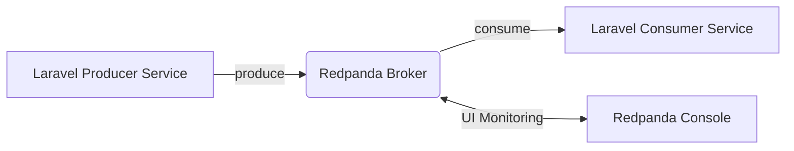

# 📡 Data Streaming con Redpanda + Laravel + ADK

Este proyecto implementa un sistema de **data streaming en tiempo real** utilizando:

- **Redpanda** como broker de eventos.
- **Laravel 12 (PHP 8.4)** como productor y consumidor de mensajes.
- **php-rdkafka** como extensión nativa para conectarse a Kafka/Redpanda mediante `librdkafka`.

Redpanda permite un sistema de mensajería moderno, de alto rendimiento y 100% compatible con Kafka.

---

## 🧱 Arquitectura General



---

# 🚀 Redpanda

El entorno incluye:

- **Redpanda Broker** — Servicio principal de streaming.
- **Redpanda Console** — Interfaz web para explorar topics, mensajes y consumer groups.

### Accesos

| Servicio | URL |
|---------|------|
| **Redpanda Console** | http://0.0.0.0:9090/ |
| **Laravel App** | http://localhost:8080/ |

---

# ⚙️ Laravel Streaming Service

Este proyecto utiliza Laravel como:

- **Productor** de eventos
- **Consumidor** de eventos
- **Cliente Kafka/Redpanda** mediante la extensión nativa:

👉 https://github.com/arnaud-lb/php-rdkafka

### Requisitos

- Extensión `rdkafka` habilitada
- `librdkafka` instalada en el sistema
- Docker para ejecución del entorno

---

# ▶️ Ejecución del entorno Laravel

### 1. Construir y ejecutar contenedores (solo la primera vez)

```bash
docker compose -f .docker/laravel/docker-compose.yml up --build
```

### 2. Iniciar entorno normalmente

```bash
docker compose -f .docker/laravel/docker-compose.yml up
```

### 3. Detener contenedores

```bash
docker compose -f .docker/laravel/docker-compose.yml down
```

---

# 🧪 Crear un Topic en Redpanda

1. Abrir Redpanda Console  
   👉 http://0.0.0.0:9090/topics

2. Crear un nuevo topic:
  - **Topic name:** `test-topic`
  - Configuración por defecto

---

# 🎧 Escuchar Eventos (Consumer)

```bash
# Entrar al contenedor de Laravel
docker exec -it laravel sh

# Ejecutar el consumer
php artisan kafka:consume-service-a
```

---

# ✉️ Producir Mensajes

Puedes utilizar Redpanda Console para enviar mensajes:

👉 http://localhost:9090/redpanda

O enviarlos desde un endpoint Laravel o un comando Artisan.

---

# 📌 Notas importantes

- Si agregas nuevos topics o cambias configuración de Redpanda, reinicia los consumers.
- Verifica que `EXTERNAL://localhost:19092` esté configurado si producirás mensajes fuera del contenedor.
- Asegúrate de que la extensión `rdkafka` esté cargada:

```bash
php -m | grep rdkafka
```

---

# 🎯 Próximos pasos sugeridos

- Añadir **monitorización** (Prometheus + Grafana)
- Crear **consumer groups** para balanceo de carga
- Implementar **reintentos**, **DLQ** y **topics compactados**
- Añadir microservicios especializados (producers/consumers dedicados)

---
